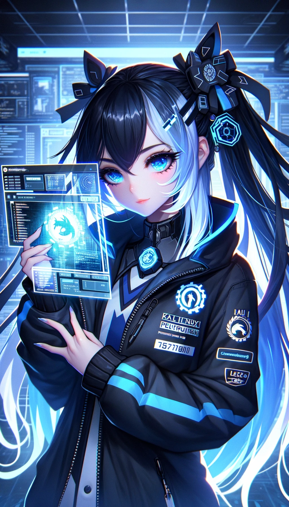

# kali-upgrade 🛠️

<p align="center">
  
</p>

## Introduction 📖
This repository contains scripts and guidelines to upgrade and customize your Kali Linux setup. 🐉 Please note: This was initially created as a backup while resetting Windows, so ensure you understand each step before executing.

## Steps to Follow:

### 1. Clean Up: 🧹
Execute the `removecrap.py` file to remove unnecessary files or settings.

### 2. Install GNOME Desktop Environment: 💻
```sh
sudo apt-get update
sudo apt install gnome -y # Note: This might show pop-ups, automation for this is in progress
sudo update-alternatives --config x-session-manager
```
Restart your system after the above steps.

### 3. Customize Desktop: 🎨
Run the `backgroundchanger.py` file to change the desktop background.

#### GNOME Extensions: ➕
Install the following GNOME extensions for enhanced functionality:
- [Sound Output Device Chooser](https://extensions.gnome.org/extension/906/sound-output-device-chooser) 🔊
- [Netspeed](https://extensions.gnome.org/extension/104/netspeed) 🚀
- [Burn My Windows](https://extensions.gnome.org/extension/4679/burn-my-windows/) 🔥
- [ArcMenu](https://extensions.gnome.org/extension/3628/arcmenu/) 🌐
- [DashToPanel](https://extensions.gnome.org/extension/1160/dash-to-panel/) 📊

After installing, disable the GNOME system menu. In Dash to Panel, disable the "Show Applications" button.

For "Burn My Windows" extension, search extensions on your machine, click settings, and choose the desired animation.

### 4. Install Applications: 📦

#### Discord: 💬
```sh
wget "https://dl.discordapp.net/apps/linux/0.0.31/discord-0.0.31.deb"
sudo dpkg -i discord-0.0.31.deb
```

#### Brave Browser: 🦁
```sh
sudo apt install curl
sudo curl -fsSLo /usr/share/keyrings/brave-browser-archive-keyring.gpg https://brave-browser-apt-release.s3.brave.com/brave-browser-archive-keyring.gpg
echo "deb [signed-by=/usr/share/keyrings/brave-browser-archive-keyring.gpg] https://brave-browser-apt-release.s3.brave.com/ stable main"|sudo tee /etc/apt/sources.list.d/brave-browser-release.list
sudo apt update
sudo apt install brave-browser
```

After installation, unpin Firefox and pin Brave browser to the dash.

#### Gedit: 📝
```sh
sudo apt-get install gedit
xdg-mime default org.gnome.gedit.desktop text/plain
```

#### Nautilus: 🗂️
```sh
sudo apt-get install nautilus
```

#### Visual Studio Code: 🛠️
Download the `.deb` file for Visual Studio Code from [here](https://code.visualstudio.com/sha/download?build=stable&os=linux-deb-x64). After downloading, run:
```sh
sudo dpkg -i "code_*"
```

#### Suru Icons: 🎨
```sh
sudo apt-get install meson
git clone https://github.com/snwh/suru-icon-theme.git
cd suru-icon-theme
meson "build" --prefix=/usr
sudo ninja -C "build" install
gsettings set org.gnome.desktop.interface icon-theme "Suru"
```

#### Konsole: 🖥️
```sh
sudo apt-get install konsole
```
After installation, pin Konsole to the dash menu and remove the terminal.

### 5. Update Profile Picture: 🖼️
```sh
sudo nano /var/lib/AccountsService/users/kali
```
